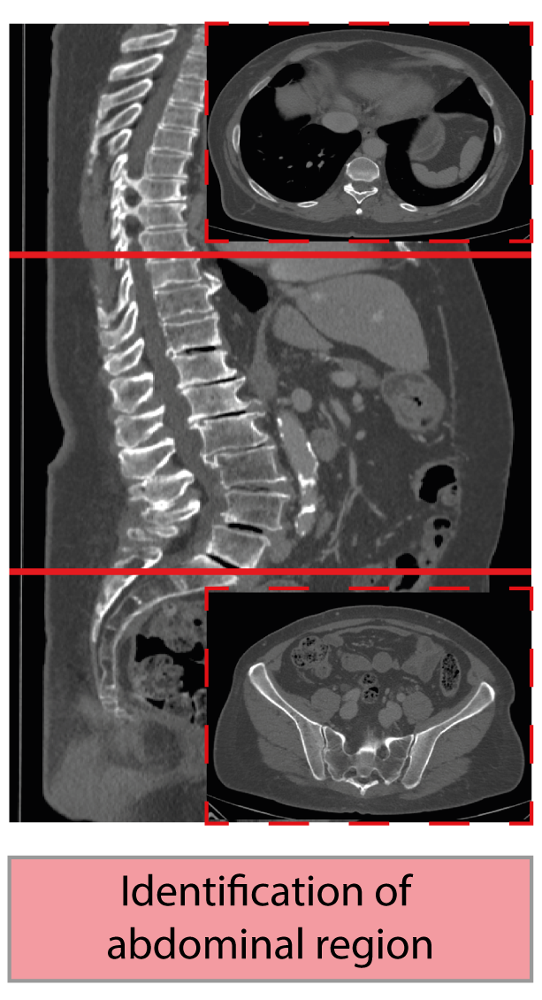

# Abdominal-Body-Region-Classifier

A Pytorch Model which classifies CT image slices to extract the abdominal region from a whole body scan.



# Usage

```
python main.py directory_of_ct_image_series/ output_directory/abdomen.nii.gz
```
